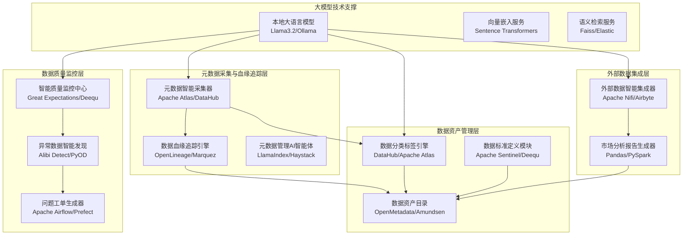

ALGORITHMIC TRADING Pratice
yahoo_fin as data reader
backtrader as strategy engine
sklearn as predition model

```mermaid
flowchart TB
    subgraph "元数据采集与血缘追踪层"
        MetaCollector[元数据智能采集器<br/>Apache Atlas/DataHub]
        LineageTracker[数据血缘追踪引擎<br/>OpenLineage/Marquez]
        AIAgent[元数据管理AI智能体<br/>LlamaIndex/Haystack]
    end

    subgraph "数据资产管理层"
        AssetCatalog[数据资产目录<br/>OpenMetadata/Amundsen]
        AssetClassifier[数据分类标签引擎<br/>DataHub/Apache Atlas]
        StandardDefiner[数据标准定义模块<br/>Apache Sentinel/Deequ]
    end

    subgraph "数据质量监控层"
        QualityMonitor[智能质量监控中心<br/>Great Expectations/Deequ]
        AnomalyDetector[异常数据智能发现<br/>Alibi Detect/PyOD]
        WorkorderGenerator[问题工单生成器<br/>Apache Airflow/Prefect]
    end

    subgraph "外部数据集成层"
        ExternalDataIntegrator[外部数据智能集成器<br/>Apache Nifi/Airbyte]
        MarketAnalyzer[市场分析报告生成器<br/>Pandas/PySpark]
    end

    subgraph "大模型技术支撑"
        LocalLLM[本地大语言模型<br/>Llama3.2/Ollama]
        EmbeddingService[向量嵌入服务<br/>Sentence Transformers]
        RetrievalService[语义检索服务<br/>Faiss/Elastic]
    end

    MetaCollector --> LineageTracker
    MetaCollector --> AssetClassifier
    LineageTracker --> AssetCatalog
    AssetClassifier --> AssetCatalog
    StandardDefiner --> AssetCatalog

    QualityMonitor --> AnomalyDetector
    AnomalyDetector --> WorkorderGenerator

    ExternalDataIntegrator --> MarketAnalyzer
    MarketAnalyzer --> AssetCatalog

    LocalLLM --> MetaCollector
    LocalLLM --> AssetClassifier
    LocalLLM --> QualityMonitor
    LocalLLM --> ExternalDataIntegrator
```