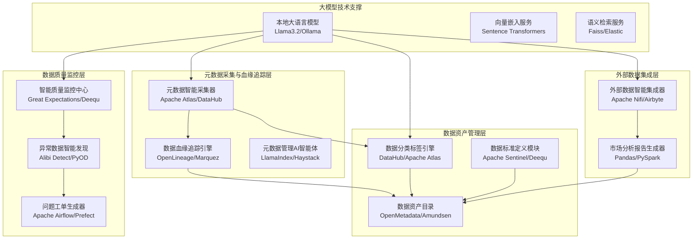
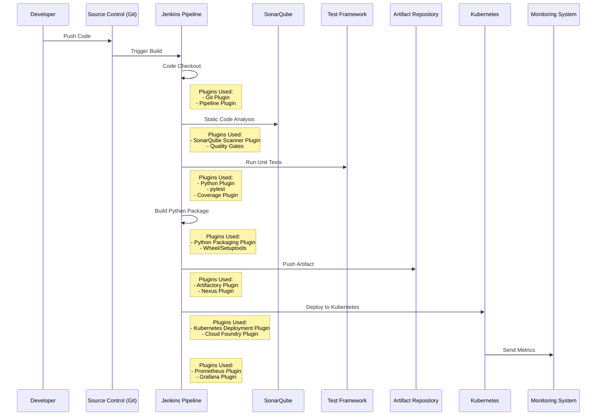
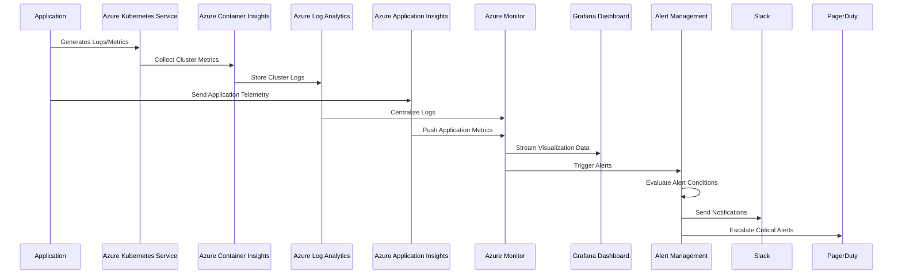
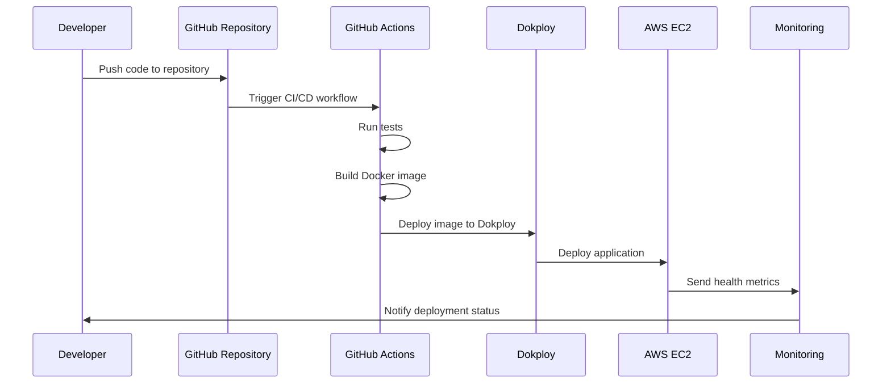

ALGORITHMIC TRADING Pratice
yahoo_fin as data reader
backtrader as strategy engine
sklearn as predition model





#### CI/CD pipeline design with github acition + dokploy + aws ec2,

#### GitHub Actions workflow script:
``` script
name: CI/CD Pipeline

on:
  push:
    branches: [ main ]
  pull_request:
    branches: [ main ]

env:
  DOKPLOY_TOKEN: ${{ secrets.DOKPLOY_TOKEN }}
  DOKPLOY_PROJECT_ID: ${{ secrets.DOKPLOY_PROJECT_ID }}
  AWS_REGION: us-east-1

jobs:
  test-and-build:
    runs-on: ubuntu-latest
    
    steps:
    - uses: actions/checkout@v4
    
    # Set up Node.js (adjust based on your project)
    - name: Use Node.js
      uses: actions/setup-node@v4
      with:
        node-version: '20.x'
    
    # Install dependencies
    - name: Install Dependencies
      run: npm ci
    
    # Run tests
    - name: Run Tests
      run: npm test
    
    # Build Docker image
    - name: Build Docker Image
      run: docker build -t my-app:${{ github.sha }} .
    
    # Login to Docker registry
    - name: Login to Docker Registry
      run: echo "${{ secrets.DOCKER_PASSWORD }}" | docker login -u "${{ secrets.DOCKER_USERNAME }}" --password-stdin
    
    # Push image to registry
    - name: Push to Docker Registry
      run: |
        docker tag my-app:${{ github.sha }} ${{ secrets.DOCKER_REGISTRY }}/my-app:${{ github.sha }}
        docker push ${{ secrets.DOCKER_REGISTRY }}/my-app:${{ github.sha }}

  deploy:
    needs: test-and-build
    runs-on: ubuntu-latest
    
    steps:
    # Deploy to Dokploy
    - name: Deploy to Dokploy
      run: |
        curl -X POST \
          -H "Authorization: Bearer $DOKPLOY_TOKEN" \
          -H "Content-Type: application/json" \
          -d '{
            "projectId": "'$DOKPLOY_PROJECT_ID'",
            "image": "'${{ secrets.DOCKER_REGISTRY }}/my-app:${{ github.sha }}'"
          }' \
          https://dokploy.yourdomain.com/api/deployments
    
    # Optional: Health check
    - name: Check Deployment Health
      run: |
        sleep 60  # Wait for deployment
        curl -f https://your-app-domain.com/health || exit 1
```
#### Dokploy configuration script:
```script
version: '3.8'

services:
  app:
    image: ${DOCKER_REGISTRY}/my-app:${GITHUB_SHA}
    ports:
      - "3000:3000"
    environment:
      - NODE_ENV=production
      - DATABASE_URL=${DATABASE_URL}
    deploy:
      replicas: 2
      update_config:
        parallelism: 1
        delay: 10s
        order: stop-first
    healthcheck:
      test: ["CMD", "curl", "-f", "http://localhost:3000/health"]
      interval: 30s
      timeout: 10s
      retries: 3
      start_period: 40s

networks:
  app_network:
    driver: bridge
```

####  EC2 setup script:
```
#!/bin/bash

# Update system
sudo yum update -y

# Install Docker
sudo yum install -y docker
sudo service docker start
sudo usermod -a -G docker ec2-user

# Install Docker Compose
sudo curl -L "https://github.com/docker/compose/releases/latest/download/docker-compose-$(uname -s)-$(uname -m)" -o /usr/local/bin/docker-compose
sudo chmod +x /usr/local/bin/docker-compose

# Install CloudWatch Agent for monitoring
sudo yum install -y amazon-cloudwatch-agent

# Configure CloudWatch Agent
sudo /opt/aws/amazon-cloudwatch-agent/bin/amazon-cloudwatch-agent-config-wizard

# Start CloudWatch Agent
sudo systemctl start amazon-cloudwatch-agent
sudo systemctl enable amazon-cloudwatch-agent

# Pull and run application (typically done via Dokploy)
docker pull ${DOCKER_REGISTRY}/my-app:latest
docker run -d -p 3000:3000 ${DOCKER_REGISTRY}/my-app:latest
```