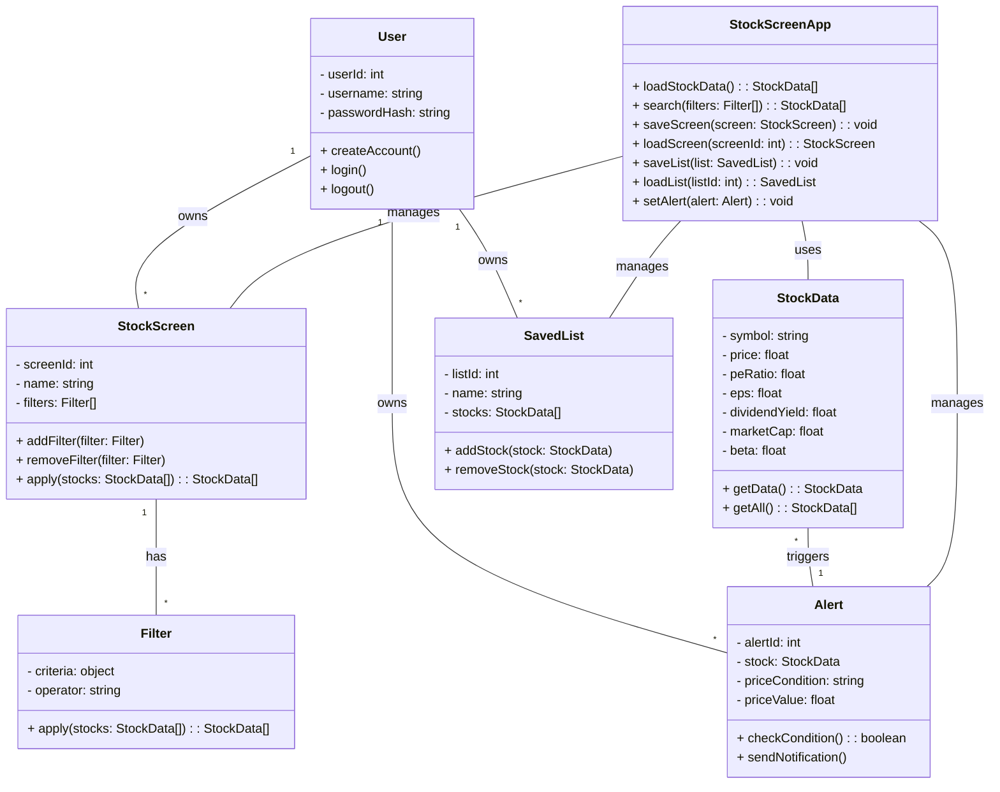
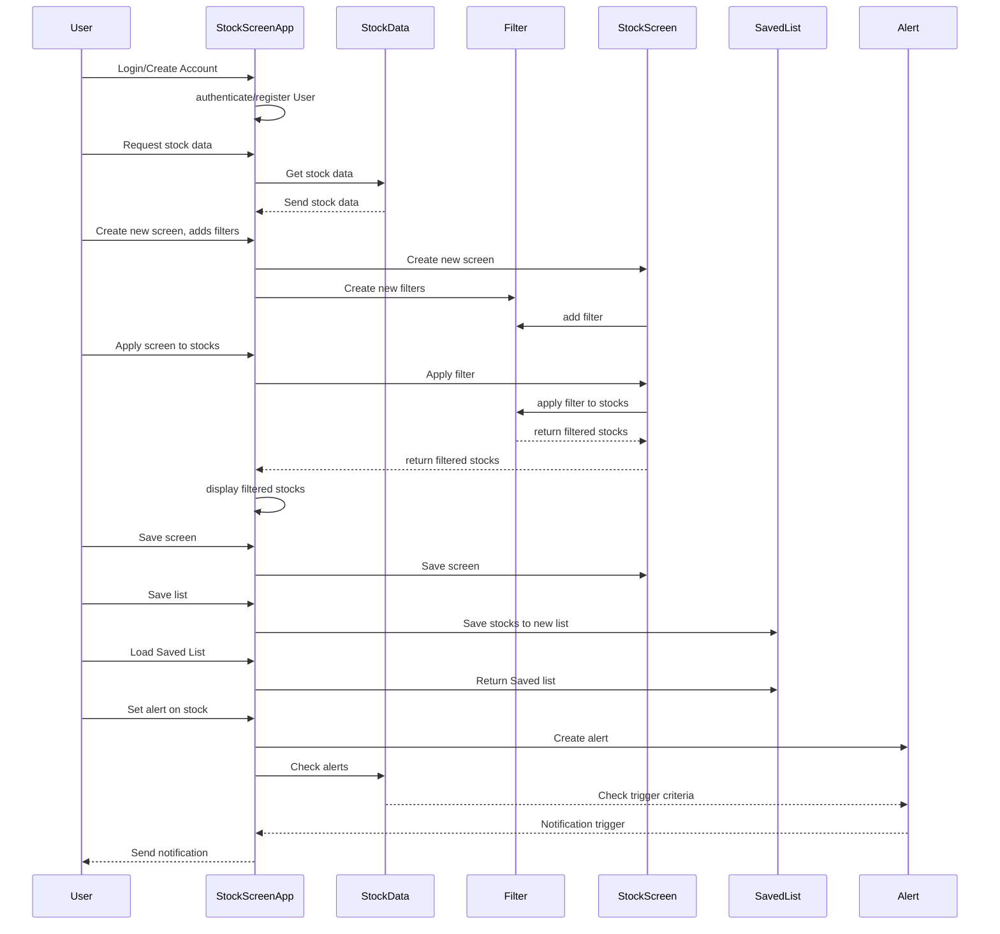

#### classDiagram

```mermaid
classDiagram
    class User {
        - userId: int
        - username: string
        - passwordHash: string
        + createAccount()
        + login()
        + logout()
    }
    class StockData {
        - symbol: string
        - price: float
        - peRatio: float
        - eps: float
        - dividendYield: float
        - marketCap: float
        - beta: float
        + getData(): StockData
        + getAll(): StockData[]
    }
    class Filter {
        - criteria: object
        - operator: string
        + apply(stocks: StockData[]): StockData[]
    }
    class StockScreen {
        - screenId: int
        - name: string
        - filters: Filter[]
        + addFilter(filter: Filter)
        + removeFilter(filter: Filter)
        + apply(stocks: StockData[]): StockData[]
    }
    class SavedList {
        - listId: int
        - name: string
        - stocks: StockData[]
        + addStock(stock: StockData)
        + removeStock(stock: StockData)
    }
    class Alert {
        - alertId: int
        - stock: StockData
        - priceCondition: string
        - priceValue: float
        + checkCondition(): boolean
        + sendNotification()
    }
    class StockScreenApp {
        + loadStockData(): StockData[]
        + search(filters: Filter[]): StockData[]
        + saveScreen(screen: StockScreen): void
        + loadScreen(screenId: int): StockScreen
        + saveList(list: SavedList): void
        + loadList(listId: int): SavedList
        + setAlert(alert: Alert): void
    }
    User "1" -- "*" StockScreen: owns
    User "1" -- "*" SavedList: owns
    User "1" -- "*" Alert : owns
    StockData "*" -- "1" Alert : triggers
    StockScreen "1" -- "*" Filter: has
    StockScreenApp -- StockData: uses
    StockScreenApp -- StockScreen: manages
    StockScreenApp -- SavedList: manages
    StockScreenApp -- Alert: manages
```
#### sequenceDiagram

```mermaid
sequenceDiagram
    participant User
    participant StockScreenApp
    participant StockData
    participant Filter
    participant StockScreen
    User ->> StockScreenApp: Login/Create Account
    StockScreenApp ->> StockScreenApp: authenticate/register User
    User ->> StockScreenApp: Request stock data
    StockScreenApp ->> StockData: Get stock data
    StockData -->> StockScreenApp: Send stock data
    User ->> StockScreenApp: Create new screen, adds filters
    StockScreenApp ->> StockScreen: Create new screen
    StockScreenApp ->> Filter: Create new filters
    StockScreen ->> Filter: add filter
    User ->> StockScreenApp: Apply screen to stocks
    StockScreenApp ->> StockScreen: Apply filter
    StockScreen ->> Filter: apply filter to stocks
    Filter -->> StockScreen: return filtered stocks
    StockScreen -->> StockScreenApp: return filtered stocks
    StockScreenApp ->> StockScreenApp: display filtered stocks
    User ->> StockScreenApp: Save screen
    StockScreenApp ->> StockScreen: Save screen
    User ->> StockScreenApp: Save list
    StockScreenApp ->> SavedList: Save stocks to new list
    User ->> StockScreenApp: Load Saved List
    StockScreenApp ->> SavedList: Return Saved list
    User ->> StockScreenApp: Set alert on stock
    StockScreenApp ->> Alert: Create alert
    StockScreenApp ->> StockData: Check alerts
    StockData -->> Alert: Check trigger criteria
    Alert -->> StockScreenApp: Notification trigger
    StockScreenApp -->> User: Send notification
```