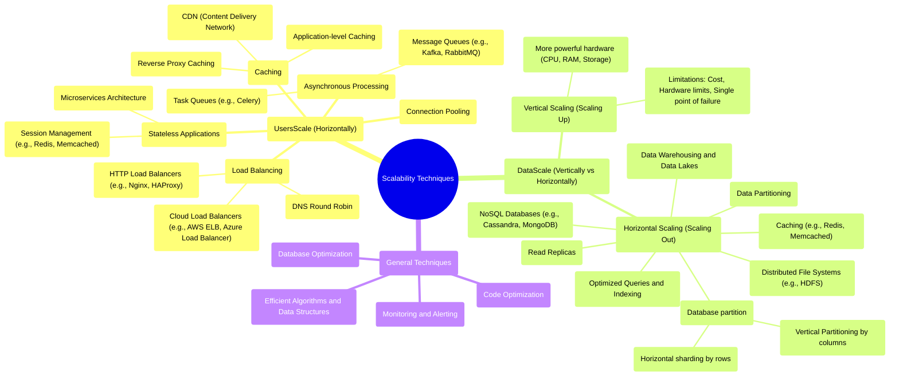

```mermaid
mindmap
  root((Scalability Techniques))
    sub("UsersScale (Horizontally)")
      sub("Load Balancing")
        sub("DNS Round Robin")
        sub("HTTP Load Balancers (e.g., Nginx, HAProxy)")
        sub("Cloud Load Balancers (e.g., AWS ELB, Azure Load Balancer)")
      sub("Stateless Applications")
        sub("Session Management (e.g., Redis, Memcached)")
        sub("Microservices Architecture")
      sub("Caching")
        sub("CDN (Content Delivery Network)")
        sub("Reverse Proxy Caching")
        sub("Application-level Caching")
      sub("Connection Pooling")
      sub("Asynchronous Processing")
        sub("Message Queues (e.g., Kafka, RabbitMQ)")
        sub("Task Queues (e.g., Celery)")
    sub("DataScale (Vertically vs Horizontally)")
      sub("Vertical Scaling (Scaling Up)")
        sub("More powerful hardware (CPU, RAM, Storage)")
        sub("Limitations: Cost, Hardware limits, Single point of failure")
      sub("Horizontal Scaling (Scaling Out)")
        sub("Database partition")
          sub("Horizontal sharding by rows")
          sub("Vertical Partitioning by columns")
        sub("Read Replicas")
        sub("Caching (e.g., Redis, Memcached)")
        sub("Data Partitioning")
        sub("Distributed File Systems (e.g., HDFS)")
        sub("NoSQL Databases (e.g., Cassandra, MongoDB)")
        sub("Data Warehousing and Data Lakes")
        sub("Optimized Queries and Indexing")
    sub("General Techniques")
      sub("Monitoring and Alerting")
      sub("Code Optimization")
      sub("Database Optimization")
      sub("Efficient Algorithms and Data Structures")
```